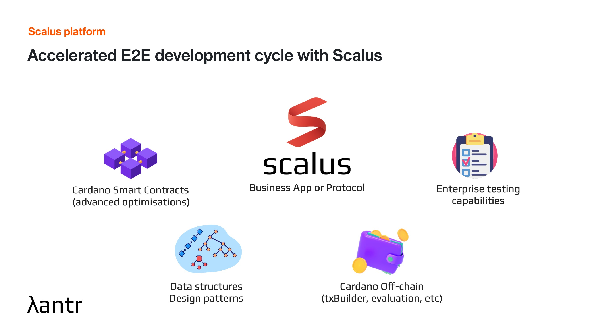

# Scalus — Smart contract & dApps Development Platform for Cardano

<p>
  
</p>


[](https://discord.gg/ygwtuBybsy)

*Built by [Lantr Engineering](https://lantr.io) · in continuous development since 2024*

## Vision

Scalus is a production-ready Smart contract & dApps development platform for Cardano built in Scala 3. It covers the full development journey: build, test, debug, optimise, integrate, deploy, and operate a protocol/application in one integrated stack. 

It's built for teams shipping L2s, bridges, DEXs, and other systems where the contract is only one part of what has to be correct.

--- 

## What Scalus includes



Scalus covers the full Cardano development lifecycle: write validators, compile and optimize UPLC, test and debug locally, build transactions, generate blueprints, deploy scripts, and run tooling across JVM, JavaScript/TypeScript, and Native targets.

---

## Platform at a glance

Scalus is not just a Scala-to-UPLC compiler. It is an integrated Cardano development stack.

| Platform area | Components | What it gives you | Where to look |
|---|---|---|---|
| Smart-contract language | Scala 3, `@Compile`, Plutus V1/V2/V3 validators, typed datums/redeemers | Write Cardano validators in a typed, mainstream language with IDE support. | [`scalus-core`](scalus-core), [`scalus-plugin`](scalus-plugin), [Smart Contracts](https://scalus.org/docs/smart-contracts) |
| Compiler pipeline | SIR, lowering, UPLC generation, optimizer, source-position tracking | Control and inspect the path from Scala source to production UPLC. | [`scalus-core`](scalus-core), [`scalus-plugin`](scalus-plugin) |
| On-chain standard library | Plutus Prelude, builtins, data conversion, crypto, collections | Use Cardano primitives and reusable data types directly in validators. | [`scalus-core`](scalus-core), [Language Guide](https://scalus.org/docs/language-guide) |
| Advanced on-chain structures | Merkle Tree, Incremental Merkle Tree, Merkle Patricia Forestry, Bilinear Accumulators | Build efficient authenticated data structures and membership proofs. | [`scalus-core`](scalus-core), [Advanced Data Structures](https://scalus.org/docs/advanced-data-structures) |
| Design pattern library | Withdraw Zero, Transaction-Level Minting, Merkelized Validator, Parameter Validation, UTxO Indexer, Linked List, Validity Range | Reuse hardened Cardano contract patterns instead of rebuilding them per protocol. | [`scalus-design-patterns`](scalus-design-patterns), [Design Patterns](https://scalus.org/docs/design-patterns) |
| Off-chain transactions | TxBuilder, UTxO selection, fee calculation, balancing, script evaluation, indexed redeemers | Build payments, minting, staking, governance, and script transactions in one API. | [`scalus-cardano-ledger`](scalus-cardano-ledger), [Transactions](https://scalus.org/docs/transactions) |
| Ledger and emulator | In-memory Cardano L1 emulator, ledger rules, snapshots, local test workflows | Validate transactions locally without a running node, then graduate to devnet/testnet. | [`scalus-cardano-ledger`](scalus-cardano-ledger), [Emulator](https://scalus.org/docs/testing/emulator) |
| Wallet and serialization | HD wallet support, BIP-39, BIP32-Ed25519, CIP-1852, Flat, CBOR, JSON | Move between keys, addresses, scripts, transactions, and wire formats. | [`scalus-cardano-ledger`](scalus-cardano-ledger), [`scalus-core`](scalus-core) |
| Enterprise testing | ScalaTest, ScalaCheck, boundary tests, attack scenarios, multi-transaction scenarios | Test validator logic, invariants, and full protocol flows before deployment. | [`scalus-testkit`](scalus-testkit), [Testing](https://scalus.org/docs/testing) |
| Debugging and profiling | IDE breakpoints, source-position tracking, CEK reports, budget profiling | Debug validators as Scala code and identify expensive script paths. | [`scalus-testkit`](scalus-testkit), [Debugging](https://scalus.org/docs/testing/debugging), [Profiling](https://scalus.org/docs/testing/profiling) |
| Blueprints and deployment | CIP-57 blueprint generation, JAR embedding, reference-script deployment tasks | Package verifiable contract artifacts and deploy reference scripts from sbt. | [`scalus-sbt-plugin`](scalus-sbt-plugin), [SBT Plugin](https://scalus.org/docs/dapp-development/sbt-plugin) |
| Example catalogue | Auctions, lottery, HTLC, AMM, escrow, vesting, NFTs, vaults, identity, payment splitter, factory, proxy | Study complete contracts and transaction flows by domain. | [`scalus-examples`](scalus-examples), [Blueprint catalogue](#blueprint-catalogue) |
| Multiplatform targets | JVM, JavaScript/TypeScript, Native | Run compiler, evaluator, emulator, and transaction tooling in backend, browser/Node, and native contexts. | [`scalus-cardano-ledger/js`](scalus-cardano-ledger/js), [Multiplatform](https://scalus.org/docs/multiplatform) |
| Performance tooling | UPLC optimizer, low-level UPLC Term DSL, CEK/JIT evaluation, JMH benchmarks | Reduce script size/cost and measure evaluator/compiler performance. | [`scalus-uplc-jit-compiler`](scalus-uplc-jit-compiler), [`bench`](bench) |
| Application runtime *(in development)* | Chain follower, typed UTxO indexing, durable reactive workers, scheduler, persistence | Operate full Cardano applications, not just compile scripts. | [`scalus-utxo-cell`](scalus-utxo-cell), [`docs`](docs) |

### Multiplatform support


Scalus is designed so the same core Cardano model can be used across the parts of an application that usually drift apart: on-chain validators, backend services, browser or Node.js tooling, transaction builders, and local test infrastructure.

On JVM, Scalus provides the full Scala developer experience: compiler plugin, transaction builder, ledger/emulator APIs, testing, profiling, and integration with JVM Cardano tooling. On JavaScript/TypeScript, the `scalus` npm package exposes the emulator, Plutus script evaluation, cost calculation, and related Cardano utilities for Node.js and browser-oriented workflows. Native support keeps the evaluator and low-level tooling available where embedding or performance-sensitive execution matters.

---

## How Scalus differs

**Aiken** is a focused Cardano smart-contract language. **Plutarch** gives Haskell teams low-level control over generated Plutus code. **Yaci DevKit** provides a local Cardano devnet. **Balius** explores headless Cardano application runtimes.

Scalus has a different center of gravity: it aims to be a full JVM-based Cardano development platform, built around Scala 3 and available across JVM, JavaScript/TypeScript, and Native targets. It combines smart-contract development, the compiler pipeline, optimization controls, transaction building, ledger/emulator workflows, testing, debugging, profiling, CIP-57 blueprints, example contracts, and multiplatform tooling in one stack.

That matters for teams building non-trivial protocols, because the hard part is rarely only writing a validator. The hard part is keeping contracts, off-chain code, tests, transaction flows, deployment artifacts, and long-term operations coherent as the protocol evolves.

Read more: [Cardano Smart Contract Development Platform](https://scalus.org/docs/cardano-smart-contract-development-platform).

---

## Quickstart

Create a minimal Scalus validator project:

```sh
sbt new scalus3/hello.g8
cd hello-cardano
sbt test
```

This generates a Plutus V3 spending validator, unit tests, integration tests, and a compiled contract wrapper.

For a fuller dApp-ready starter with CIP-57 blueprint generation and deployment tasks:

```sh
sbt new scalus3/validator.g8
```

Next steps:

* [Getting Started](https://scalus.org/docs/get-started) — setup and first validator
* [First Smart Contract](https://scalus.org/docs/smart-contracts/developing-smart-contracts) — write, compile, and test validators
* [Transactions](https://scalus.org/docs/transactions/building-first-transaction) — build and submit Cardano transactions
* [Testing](https://scalus.org/docs/testing/unit-testing) — unit tests, emulator, debugging, and profiling

---

## Learning paths

| Path | Start here | Then go deeper |
|---|---|---|
| New to Scalus | [Getting Started](https://scalus.org/docs/get-started) | [Project Commands](https://scalus.org/docs/get-started/project-commands), [First Smart Contract](https://scalus.org/docs/smart-contracts/developing-smart-contracts) |
| Scala developer new to Cardano | [For Scala Developers](https://scalus.org/docs/get-started/for-scala-developers) | [Transactions](https://scalus.org/docs/transactions), [Testing](https://scalus.org/docs/testing) |
| Cardano developer new to Scala | [For Cardano Developers](https://scalus.org/docs/get-started/for-cardano-developers) | [Language Guide](https://scalus.org/docs/language-guide), [Smart Contracts](https://scalus.org/docs/smart-contracts) |
| Full-stack dApp developer | [DApp Starter Tutorial](https://scalus.org/docs/dapp-development/dapp-starter-tutorial) | [Working with Contract](https://scalus.org/docs/dapp-development/working-with-contract), [Building Transactions](https://scalus.org/docs/transactions/building-first-transaction) |
| Testing and debugging | [Testing](https://scalus.org/docs/testing) | [Boundary Testing](https://scalus.org/docs/testing/boundary-testing), [Debugging](https://scalus.org/docs/testing/debugging), [Profiling](https://scalus.org/docs/testing/profiling) |
| Advanced contract design | [Design Patterns](https://scalus.org/docs/design-patterns) | [Advanced Data Structures](https://scalus.org/docs/advanced-data-structures), [Security](https://scalus.org/docs/security) |

---

## Installation

### Scala / sbt

Use the latest published Scalus version. Maven Central currently lists `0.18.2`.

`project/plugins.sbt`:

```scala
addSbtPlugin("org.scalus" % "scalus-sbt-plugin" % "0.18.2")
```

`build.sbt`:

```scala
scalaVersion := "3.3.8"

val scalusVersion = "0.18.2"

addCompilerPlugin(
  "org.scalus" % "scalus-plugin" % scalusVersion cross CrossVersion.full
)

libraryDependencies ++= Seq(
  "org.scalus" %% "scalus" % scalusVersion,
  "org.scalus" %% "scalus-cardano-ledger" % scalusVersion,
  "org.scalus" %% "scalus-testkit" % scalusVersion % Test
)
```

Use `scalus` for on-chain validators and UPLC compilation, `scalus-cardano-ledger` for transaction building and ledger/emulator APIs, and `scalus-testkit` for validator and transaction tests.

### JavaScript / TypeScript

```sh
npm install scalus
```

```ts
import { Emulator, SlotConfig, Scalus } from "scalus";
```

The JS/TS package provides the in-memory Cardano emulator, Plutus script evaluation, cost calculation, and related Cardano tooling.

---

## Quick Look

Here's a real validator, checking a signature and a redeemer, compiled to production UPLC:

```scala 3
@Compile
object HelloCardano extends Validator {
    inline override def spend(
        datum: Option[Data],
        redeemer: Data,
        tx: TxInfo,
        ownRef: TxOutRef
    ): Unit = {
        val owner = datum.getOrFail("Datum not found").to[PubKeyHash]
        val signed = tx.signatories.contains(owner)
        require(signed, "Must be signed")
        val saysHello = redeemer.to[String] == "Hello, World!"
        require(saysHello, "Invalid redeemer")
    }
}

// compile to Untyped Plutus Core (UPLC)
val compiled = PlutusV3.compile(HelloCardano.validate)
// HEX encoded Plutus script, ready to be used with cardano-cli or Blockfrost
val plutusScript = compiled.program.doubleCborHex
```

### Compilation pipeline


---

## Repository map

| Path | What it contains |
|---|---|
| [`scalus-core`](scalus-core) | Core compiler, UPLC/SIR model, Plutus evaluator, on-chain Prelude, serialization, crypto, and shared Cardano types. |
| [`scalus-plugin`](scalus-plugin) | Scala 3 compiler plugin that powers `@Compile` and turns supported Scala code into Scalus intermediate representation. |
| [`scalus-cardano-ledger`](scalus-cardano-ledger) | Cardano ledger model, transaction builder, wallet/address utilities, emulator support, and the Scala.js/npm package source. |
| [`scalus-testkit`](scalus-testkit) | Testing helpers for validators, transactions, generated Cardano data, emulator workflows, and property-based tests. |
| [`scalus-examples`](scalus-examples) | Example contracts and transaction flows: Hello Cardano, lottery, auction, HTLC, AMM, escrow, vesting, payment splitter, editable NFT, and more. |
| [`scalus-design-patterns`](scalus-design-patterns) | Reusable Cardano contract patterns such as Transaction-Level Minting, Merkelized Validator, UTxO Indexer, Linked List, and Validity Range. |
| [`scalus-utxo-cell`](scalus-utxo-cell) | Experimental UTxO cell and flow framework for stateful, multi-transaction application logic. |
| [`scalus-sbt-plugin`](scalus-sbt-plugin) | sbt plugin for CIP-57 blueprint generation and reference-script deployment tasks. |
| [`scalus-uplc-jit-compiler`](scalus-uplc-jit-compiler) | JVM-side JIT compiler support for UPLC evaluation and benchmarking. |
| [`bloxbean-cardano-client-lib`](bloxbean-cardano-client-lib) | Integration layer for Bloxbean Cardano Client Lib users, published as `scalus-bloxbean-cardano-client-lib`. |
| [`bench`](bench) | JMH benchmarks for evaluator, compiler, and transaction tooling performance. |
| [`docs`](docs) | Internal design notes, historical docs, Catalyst reports, and development plans. |
| [`scalus-site`](scalus-site) | Public documentation website source and generated static site assets. |

---

## Blueprint catalogue

The examples project contains `Contract` objects with CIP-57 blueprint definitions. Generate the catalogue locally with:

```sh
sbt scalusExamplesJVM/blueprint
```

The `ScalusSbtPlugin` also embeds generated JSON files in packaged JARs under `META-INF/scalus/blueprints/<ContractName>.json`.

| Blueprint | What it demonstrates | Source |
|---|---|---|
| Hello Cardano | Minimal Plutus V3 spending validator with owner signature and redeemer checks. | [`HelloCardanoContract.scala`](scalus-examples/jvm/src/main/scala/scalus/examples/HelloCardanoContract.scala) |
| Simple Transfer | Typed datum/redeemer flow for a simple transfer contract. | [`simpletransfer`](scalus-examples/jvm/src/main/scala/scalus/examples/simpletransfer) |
| Escrow | Two-party escrow with typed configuration and spend actions. | [`escrow`](scalus-examples/jvm/src/main/scala/scalus/examples/escrow) |
| HTLC | Hash time-locked contract with lock/redeem/refund style actions. | [`htlc`](scalus-examples/jvm/src/main/scala/scalus/examples/htlc) |
| Vesting | Time-locked release of funds using validity intervals. | [`vesting`](scalus-examples/jvm/src/main/scala/scalus/examples/vesting) |
| Lottery | Commit-reveal-punish state machine with off-chain transaction builders. | [`lottery`](scalus-examples/jvm/src/main/scala/scalus/examples/lottery) |
| Auction | One-shot UTxO parameterized auction with bidding, refunds, and close logic. | [`auction`](scalus-examples/jvm/src/main/scala/scalus/examples/auction) |
| Crowdfunding | Campaign validator plus donation-token minting policy. | [`crowdfunding`](scalus-examples/jvm/src/main/scala/scalus/examples/crowdfunding) |
| Payment Splitter | Naive and optimized stake-validator payment splitting patterns. | [`paymentsplitter`](scalus-examples/jvm/src/main/scala/scalus/examples/paymentsplitter) |
| Constant-product AMM | Parameterized `x*y=k` pool with deposit, redeem, and swap actions. | [`amm`](scalus-examples/jvm/src/main/scala/scalus/examples/amm) |
| Price Bet + Oracle | Two-contract example for oracle-published prices and future-price bets. | [`pricebet`](scalus-examples/jvm/src/main/scala/scalus/examples/pricebet) |
| Editable NFT | Reference NFT validator with updateable metadata/state. | [`editablenft`](scalus-examples/jvm/src/main/scala/scalus/examples/editablenft) |
| Decentralized Identity | Identity datum/action contract for DID-style state updates. | [`decentralizedidentity`](scalus-examples/jvm/src/main/scala/scalus/examples/decentralizedidentity) |
| Vault | Stateful vault validator and transaction builders. | [`vault`](scalus-examples/jvm/src/main/scala/scalus/examples/vault) |
| Factory | Factory pattern for minting/creating contract instances. | [`factory`](scalus-examples/jvm/src/main/scala/scalus/examples/factory) |
| Upgradeable Proxy | Proxy validator for upgradeable contract indirection. | [`upgradeableproxy`](scalus-examples/jvm/src/main/scala/scalus/examples/upgradeableproxy) |

---

## Used by 

### Protocol & application development

| Project | Description | Progress | Github |
|---|---|---|---|
| [Gummiworm](https://gummiworm.net) |  A state-channel Layer 2 for Cardano, built for custody and settlement | Pre-production | [View](https://github.com/cardano-hydrozoa/hydrozoa) |
| [Bifrost](https://bifrost.fluidtokens.com) | A Bitcoin↔Cardano bridge, secured by Cardano SPOs | Testnet | [View](https://github.com/FluidTokens/ft-bifrost-bridge) |
| Vela Finance  | A decentralised synthetic stablecoin with user-set interest rates | In development | Private |

### Integrating Scalus Components

#### JVM

Script evaluation & cost calculation utilities for JVM. 

| Project |  Description | Github |
|---|--|---|
| [Cardano Client Lib](https://cardano-client.dev/)  | A widely used Java/JVM SDK for building and submitting Cardano transactions.  | [View](https://github.com/bloxbean/cardano-client-lib)|
| [YaciStore](https://store.yaci.xyz/) | A Cardano chain indexer and data store |  [View](https://github.com/bloxbean/yaci-store) |
| [Yaci DevKit](https://devkit.yaci.xyz/) |  A local Cardano devnet for development and testing | [View](https://github.com/bloxbean/yaci-devkit) |
| Yano | An early-stage, lightweight Cardano node/data layer (BloxBean) | [View](https://github.com/bloxbean/yano) | 
| JuLC | An experimental compiler from Java to UPLC | [View](https://github.com/bloxbean/julc) |

#### JavaScript / TypeScript

In-memory Cardano node emulator, script evaluation & cost calculation utilities for JS/TS.

| Project |  Description | Github |
|---|---|---|
| [MeshJS](https://meshjs.dev/) |  A widely used open-source SDK for building Cardano dApps | [View](https://github.com/MeshJS/mesh) |
| [Evolution SDK](https://intersectmbo.github.io/evolution-sdk/) | A TypeScript SDK for building Cardano transactions | [View](https://github.com/IntersectMBO/evolution-sdk) |
| [Lucid Evolution](https://anastasia-labs.github.io/lucid-evolution/) |  A TypeScript library for building Cardano transactions off-chain | [View](https://github.com/Anastasia-Labs/lucid-evolution) |

---

## Previous funding

| Workstream | Status | Reference |
|------------|----------|-----------|
| Catalyst F11 — Scalus: Multiplatform Scala implementation of Cardano Plutus | Finished | [Project ID: 1100252](https://milestones.projectcatalyst.io/projects/1100252) |
| Catalyst F11 — Multiplatform Plutus Script Cost & Evaluation Library (JS/JVM/LLVM) | Finished  | [Project ID: 1100198](https://milestones.projectcatalyst.io/projects/1100198) |
| Catalyst F13 — Scalus: Multiplatform Tx Builder — same code for front & backend    | Finished |  [Project ID: 1300009](https://milestones.projectcatalyst.io/projects/1300009) |
| 2025 Treasury Budget — Lantr: Scalus DApps Development Platform               | Finished | [Governance Action](https://adastat.net/governances/gov_action13tfag48nf94rtjcdq7c06vhkslmxxw9h6c88sl7q5g5nnewcsvlpz4s2af8) |

###  Reports 2025

- [Milestone 2](https://lantr.io/blog/scalus-intersect-budget-milestone-2/)
- [Milestone 3](https://lantr.io/blog/scalus-intersect-budget-milestone-3/)
- [Milestone 4](https://lantr.io/blog/scalus-intersect-budget-milestone-4/)
- [Milestone 5](https://lantr.io/blog/scalus-intersect-budget-milestone-5/)
- [Milestone 6](https://lantr.io/blog/scalus-intersect-budget-milestone-6/)

---

## Contributing

See [CONTRIBUTING.md](CONTRIBUTING.md) for the full contributor guide.

### Local setup

The default contributor workflow expects Java 11+ and sbt. The recommended full toolchain setup is:

```sh
nix develop
```

Then use `sbtn` or `sbt` from the repository root.

### Useful commands

| Command | Purpose |
|---|---|
| `sbtn quick` | Format, compile JVM projects, and run quick JVM tests. |
| `sbtn precommit` | Clean, format, compile, and run the main JVM test suite before committing. |
| `sbtn ci-js` | Compile and test Scala.js projects, then run npm package tests. |
| `sbtn ci-native` | Compile and test Scala Native projects. |
| `sbtn scalusExamplesJVM/blueprint` | Generate CIP-57 blueprints for the example contracts. |
| `sbtn benchmark` | Run the default JMH benchmark task. |

### Website docs

The public documentation site lives in [`scalus-site`](scalus-site) and uses pnpm:

```sh
cd scalus-site
pnpm install
pnpm dev
```

---

## Contact

Follow our progress on [X (@Scalus3)](https://x.com/Scalus3) and [X (@lantr_io)](https://x.com/lantr_io).

Join [Scalus Club](https://lu.ma/scalus) for early access and to shape the roadmap.

Questions or feedback? Reach out on [Discord](https://discord.gg/B6tXmBzhTn) or email us at [contact@lantr.io](mailto:contact@lantr.io).
