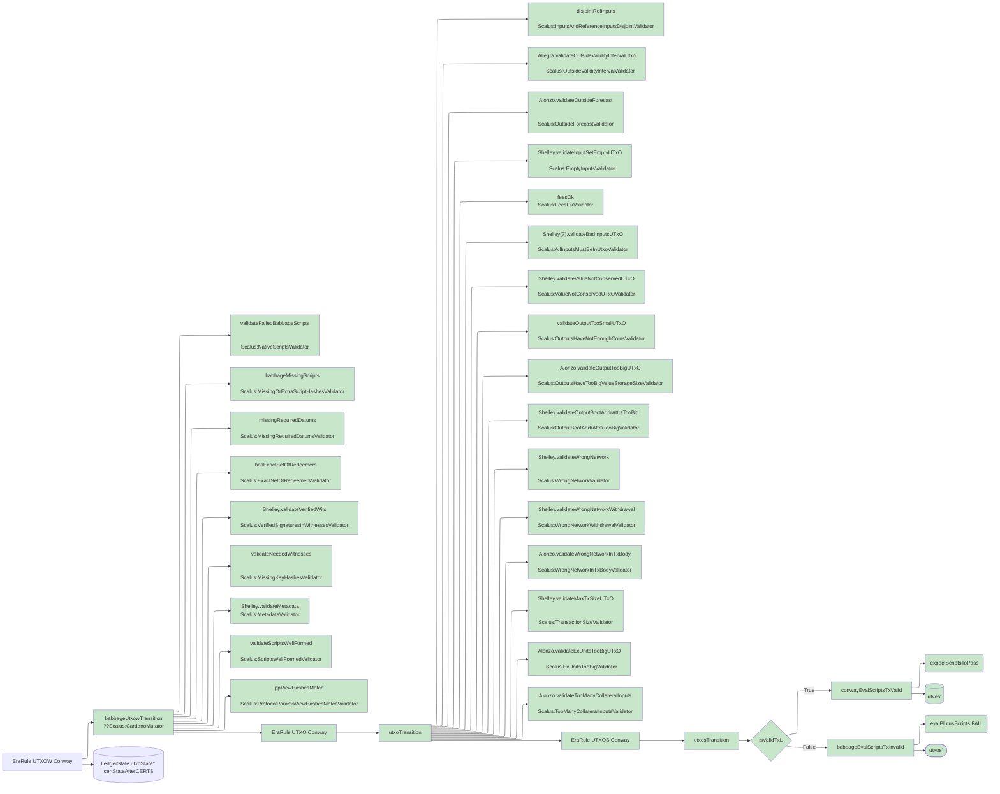

import { Callout } from 'nextra/components'

# Cardano Ledger Rules Implementation

Scalus implements Cardano's ledger validation rules in pure Scala 3, running on **JVM**, **JavaScript**, and **Native** platforms.

These rules power the [Emulator](/docs/ledger/emulator) for fast local testing, and can be used standalone for transaction validation.

<Callout type="warning">
  The Ledger Rules Framework is in active development and may change.
</Callout>

## Overview

The framework implements two validation phases matching Cardano node behavior:

- **Phase 1** — Structural validation (inputs exist, fees correct, signatures valid, size limits)
- **Phase 2** — Script execution (Plutus V1/V2/V3 and native scripts)

Rules are organized into **Validators** (check transaction validity) and **Mutators** (update ledger state).

Source: `scalus-cardano-ledger/shared/src/main/scala/scalus/cardano/ledger/rules/`

## Validating and updating UTxO state (EraRule UTXOW)

This EraRule is responsible for validating and updating the UTxO state.

Implementation progress:

### Validators

#### Input Validation
- **AllInputsMustBeInUtxoValidator** - Ensures all transaction inputs (spending, collateral, and reference inputs) exist in the UTxO set
- **EmptyInputsValidator** - Verifies that the transaction has at least one input
- **InputsAndReferenceInputsDisjointValidator** - Ensures regular inputs and reference inputs don't overlap

#### Value and Balance Validation
- **ValueNotConservedUTxOValidator** - Validates that the total value consumed equals the total value produced (conservation of value)
- **OutputsHaveNotEnoughCoinsValidator** - Checks that all outputs meet the minimum ADA requirement
- **OutputsHaveTooBigValueStorageSizeValidator** - Validates that output values don't exceed maximum storage size limits
- **OutputBootAddrAttrsSizeValidator** - Ensures bootstrap address attributes don't exceed size limits

#### Fee and Collateral Validation
- **FeesOkValidator** - Comprehensive fee validation including minimum fee check, collateral requirements, and collateral input validation
- **ExUnitsTooBigValidator** - Validates that execution units (memory and CPU steps) don't exceed protocol limits
- **TooManyCollateralInputsValidator** - Ensures the number of collateral inputs doesn't exceed the maximum allowed

#### Script Validation
- **NativeScriptsValidator** - Validates native scripts in the transaction
- **ScriptsWellFormedValidator** - Ensures all scripts are properly formed and valid
- **MissingOrExtraScriptHashesValidator** - Verifies that all required script hashes are present and no extra ones exist
- **MissingRequiredDatumsValidator** - Checks that all required datums are provided in the transaction
- **ExactSetOfRedeemersValidator** - Validates that the set of redeemers matches exactly what's needed

#### Witness Validation
- **VerifiedSignaturesInWitnessesValidator** - Verifies that all required cryptographic signatures are present and valid
- **MissingKeyHashesValidator** - Ensures all required key hashes for signing are provided

#### Network and Metadata Validation
- **WrongNetworkValidator** - Validates that transaction addresses match the expected network
- **WrongNetworkWithdrawalValidator** - Checks withdrawal addresses match the network
- **WrongNetworkInTxBodyValidator** - Validates network consistency in transaction body
- **MetadataValidator** - Validates transaction metadata format and size

#### Protocol and Transaction Validation
- **ProtocolParamsViewHashesMatchValidator** - Ensures protocol parameter view hashes match expected values
- **TransactionSizeValidator** - Validates that transaction size doesn't exceed maximum limits
- **OutsideValidityIntervalValidator** - Checks that the transaction is within its validity interval (time-to-live)
- **OutsideForecastValidator** - Validates forecast-related constraints for transaction validity

### Mutators

#### UTxO State Updates
- **AddOutputsToUtxoMutator** - Adds transaction outputs to the UTxO set
- **RemoveInputsFromUtxoMutator** - Removes consumed inputs from the UTxO set

#### Fee Processing
- **FeeMutator** - Updates ledger state with transaction fees

#### Script Execution
- **PlutusScriptsTransactionMutator** - Handles Plutus script execution and updates state accordingly

#### Composition
- **CardanoMutator** - The main composition mutator that orchestrates all validators and mutators in the correct order, automatically discovering all rule implementations in the package

All rules follow the State Transition System (STS) pattern, providing a type-safe, composable framework for implementing Cardano ledger semantics in Scala 3.

## See Also

- [Emulator](/docs/ledger/emulator) — In-memory node using these rules for fast testing
- [Yaci DevKit](/docs/ledger/yaci-devkit) — Docker-based devnet with real Cardano node
- [Protocol Parameters](/docs/ledger/protocol-parameters) — Network configuration used by validators
