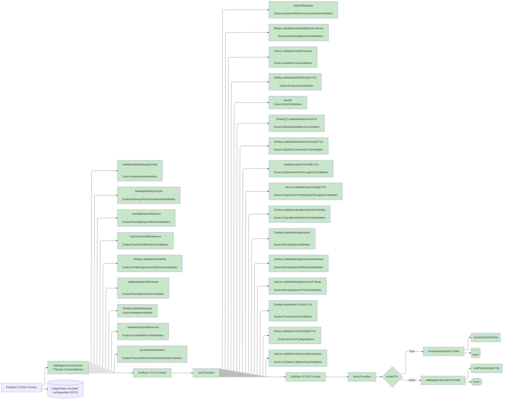

# Ledger Rules Reference

This page catalogs all built-in validators and mutators in the Scalus [Ledger Rules Framework](/docs/ledger). For architecture, composition, and customization patterns, see the [Framework overview](/docs/ledger).

## Validating and updating UTxO state (EraRule UTXOW)

The following diagram shows how Scalus validators and mutators map to the Conway-era UTXOW state transition in the Cardano ledger:

```mermaid
---
config:
  layout: elk
---
flowchart LR
EUC[EraRule UTXOW Conway]
    EUC --> babbageUtxowTransition["babbageUtxowTransition
                                    ??Scalus:CardanoMutator"]:::done
        babbageUtxowTransition --> validateFailedBabbageScripts["validateFailedBabbageScripts
                                                                Scalus:NativeScriptsValidator"]:::done
        babbageUtxowTransition --> babbageMissingScripts["babbageMissingScripts
                                                        Scalus:MissingOrExtraScriptHashesValidator"]:::done
        babbageUtxowTransition --> missingRequiredDatums["missingRequiredDatums
                                                        Scalus:MissingRequiredDatumsValidator"]:::done
        babbageUtxowTransition --> hasExactSetOfRedeemers["hasExactSetOfRedeemers
                                                        Scalus:ExactSetOfRedeemersValidator"]:::done
        babbageUtxowTransition --> validateVerifiedWits["Shelley.validateVerifiedWits
                                                        Scalus:VerifiedSignaturesInWitnessesValidator"]:::done
        babbageUtxowTransition --> validateNeededWitnesses["validateNeededWitnesses
                                                            Scalus:MissingKeyHashesValidator"]:::done
        babbageUtxowTransition --> validateMetadata["Shelley.validateMetadata
                                                    Scalus:MetadataValidator"]:::done
        babbageUtxowTransition --> validateScriptsWellFormed["validateScriptsWellFormed
                                                    Scalus:ScriptsWellFormedValidator"]:::done
        babbageUtxowTransition --> ppViewHashesMatch["ppViewHashesMatch
                                                    Scalus:ProtocolParamsViewHashesMatchValidator"]:::done
        babbageUtxowTransition --> EUTXOC[EraRule UTXO Conway]:::done
            EUTXOC --> utxoTransition:::done
                utxoTransition --> disjointRefInputs["disjointRefInputs
                                                    Scalus:InputsAndReferenceInputsDisjointValidator"]:::done
                utxoTransition --> validateOutsideValidityIntervalUtxo["Allegra.validateOutsideValidityIntervalUtxo
                                                                        Scalus:OutsideValidityIntervalValidator"]:::done
                utxoTransition --> validateOutsideForecast["Alonzo.validateOutsideForecast
                                                            Scalus:OutsideForecastValidator"]:::done
                utxoTransition --> validateInputSetEmptyUTxO["Shelley.validateInputSetEmptyUTxO
                                                            Scalus:EmptyInputsValidator"]:::done
                utxoTransition --> feesOk["feesOk
                                        Scalus:FeesOkValidator"]:::done
                utxoTransition --> validateBadInputsUTxO["Shelley(?).validateBadInputsUTxO
                                                        Scalus:AllInputsMustBeInUtxoValidator"]:::done
                utxoTransition --> validateValueNotConservedUTxO["Shelley.validateValueNotConservedUTxO
                                                        Scalus:ValueNotConservedUTxOValidator"]:::done
                utxoTransition --> validateOutputTooSmallUTxO["validateOutputTooSmallUTxO
                                                            Scalus:OutputsHaveNotEnoughCoinsValidator"]:::done
                utxoTransition --> validateOutputTooBigUTxO["Alonzo.validateOutputTooBigUTxO
                                                           Scalus:OutputsHaveTooBigValueStorageSizeValidator"]:::done
                utxoTransition --> validateOutputBootAddrAttrsTooBig["Shelley.validateOutputBootAddrAttrsTooBig
                                                                    Scalus:OutputBootAddrAttrsTooBigValidator"]:::done
                utxoTransition --> validateWrongNetwork["Shelley.validateWrongNetwork
                                                        Scalus:WrongNetworkValidator"]:::done
                utxoTransition --> validateWrongNetworkWithdrawal["Shelley.validateWrongNetworkWithdrawal
                                                                Scalus:WrongNetworkWithdrawalValidator"]:::done
                utxoTransition --> validateWrongNetworkInTxBody["Alonzo.validateWrongNetworkInTxBody
                                                                Scalus:WrongNetworkInTxBodyValidator"]:::done
                utxoTransition --> validateMaxTxSizeUTxO["Shelley.validateMaxTxSizeUTxO
                                                                Scalus:TransactionSizeValidator"]:::done
                utxoTransition --> validateExUnitsTooBigUTxO["Alonzo.validateExUnitsTooBigUTxO
                                                            Scalus:ExUnitsTooBigValidator"]:::done
                utxoTransition --> validateTooManyCollateralInputs["Alonzo.validateTooManyCollateralInputs
                                                                Scalus:TooManyCollateralInputsValidator"]:::done
                utxoTransition --> EUTXOSC[EraRule UTXOS Conway]:::done
                    EUTXOSC --> utxosTransition:::done
                utxosTransition --> isValidTxL{isValidTxL}:::done
                    isValidTxL --> |True| conwayEvalScriptsTxValid:::done
                        conwayEvalScriptsTxValid --> expectScriptsToPass(expactScriptsToPass):::done
                        conwayEvalScriptsTxValid --> conwayEvalScriptsTxValidUtxosPrime[(utxos')]:::done
                    isValidTxL --> |False| babbageEvalScriptsTxInvalid:::done
                        babbageEvalScriptsTxInvalid --> evalPlutusScripts(evalPlutusScripts FAIL):::done
                        babbageEvalScriptsTxInvalid --> babbageEvalScriptsTxInvalidUtxosPrime([utxos']):::done
    EUC --> LedgerState[(LedgerState utxoState'' certStateAfterCERTS)]

    classDef todo  fill:#FFCDD2
    classDef wip  fill:#FFE0B2
    classDef question fill:#E1BEE7
    classDef done  fill:#C8E6C9
```

## Validators

### Input Validation
- **AllInputsMustBeInUtxoValidator** — Ensures all transaction inputs (spending, collateral, and reference inputs) exist in the UTxO set
- **EmptyInputsValidator** — Verifies that the transaction has at least one input
- **InputsAndReferenceInputsDisjointValidator** — Ensures regular inputs and reference inputs don't overlap

### Value and Balance Validation
- **ValueNotConservedUTxOValidator** — Validates that the total value consumed equals the total value produced (conservation of value)
- **OutputsHaveNotEnoughCoinsValidator** — Checks that all outputs meet the minimum ADA requirement
- **OutputsHaveTooBigValueStorageSizeValidator** — Validates that output values don't exceed maximum storage size limits
- **OutputBootAddrAttrsSizeValidator** — Ensures bootstrap address attributes don't exceed size limits

### Fee and Collateral Validation
- **FeesOkValidator** — Comprehensive fee validation including minimum fee check, collateral requirements, and collateral input validation
- **ExUnitsTooBigValidator** — Validates that execution units (memory and CPU steps) don't exceed protocol limits
- **TooManyCollateralInputsValidator** — Ensures the number of collateral inputs doesn't exceed the maximum allowed

### Script Validation
- **NativeScriptsValidator** — Validates native scripts in the transaction
- **ScriptsWellFormedValidator** — Ensures all scripts are properly formed and valid
- **MissingOrExtraScriptHashesValidator** — Verifies that all required script hashes are present and no extra ones exist
- **MissingRequiredDatumsValidator** — Checks that all required datums are provided in the transaction
- **ExactSetOfRedeemersValidator** — Validates that the set of redeemers matches exactly what's needed

### Witness Validation
- **VerifiedSignaturesInWitnessesValidator** — Verifies that all required cryptographic signatures are present and valid
- **MissingKeyHashesValidator** — Ensures all required key hashes for signing are provided

### Network and Metadata Validation
- **WrongNetworkValidator** — Validates that transaction addresses match the expected network
- **WrongNetworkWithdrawalValidator** — Checks withdrawal addresses match the network
- **WrongNetworkInTxBodyValidator** — Validates network consistency in transaction body
- **MetadataValidator** — Validates transaction metadata format and size

### Stake and Certificate Validation
- **CertsValidator** — Conway CERTS rule: validates certificate sequences in the transaction
- **StakeCertificatesValidator** — Conway DELEG rule: validates stake registration, deregistration, and delegation certificates
- **StakePoolCertificatesValidator** — Conway POOL rule: validates stake pool registration and retirement certificates

### Protocol and Transaction Validation
- **ProtocolParamsViewHashesMatchValidator** — Ensures protocol parameter view hashes match expected values
- **TransactionSizeValidator** — Validates that transaction size doesn't exceed maximum limits
- **OutsideValidityIntervalValidator** — Checks that the transaction is within its validity interval (time-to-live)
- **OutsideForecastValidator** — Validates forecast-related constraints for transaction validity

## Mutators

### Script Execution
- **PlutusScriptsTransactionMutator** — Evaluates Plutus scripts (V1/V2/V3), processes collateral on script failure, and updates the UTxO set (adds outputs, removes consumed inputs)

### Stake Delegation
- **StakeCertificatesMutator** — Processes stake delegation certificates (registration, deregistration, delegation) and updates the delegation state

### Composition
- **CardanoMutator** — Top-level orchestrator that runs all `DefaultValidators.all` then `DefaultMutators.all` in sequence

## Conway Rule Mapping

The following table maps Cardano ledger rules (from [cardano-ledger](https://github.com/IntersectMBO/cardano-ledger)) to their Scalus implementations:

| Cardano Ledger Rule | Scalus Implementation |
|---|---|
| Conway UTXOW | `CardanoMutator` (orchestrator) |
| Conway CERTS | `CertsValidator` |
| Conway DELEG | `StakeCertificatesValidator` + `StakeCertificatesMutator` |
| Conway POOL | `StakePoolCertificatesValidator` |
| Conway UTXOS (isValid=true) | `PlutusScriptsTransactionMutator` |
| Conway UTXOS (isValid=false) | `PlutusScriptsTransactionMutator` |
| Shelley.validateValueNotConservedUTxO | `ValueNotConservedUTxOValidator` |
| Shelley.validateBadInputsUTxO | `AllInputsMustBeInUtxoValidator` |
| Shelley.validateInputSetEmptyUTxO | `EmptyInputsValidator` |
| Shelley.validateVerifiedWits | `VerifiedSignaturesInWitnessesValidator` |
| Shelley.validateNeededWitnesses | `MissingKeyHashesValidator` |
| Shelley.validateMetadata | `MetadataValidator` |
| Shelley.validateMaxTxSizeUTxO | `TransactionSizeValidator` |
| Shelley.validateWrongNetwork | `WrongNetworkValidator` |
| Shelley.validateWrongNetworkWithdrawal | `WrongNetworkWithdrawalValidator` |
| Shelley.validateOutputBootAddrAttrsTooBig | `OutputBootAddrAttrsSizeValidator` |
| Allegra.validateOutsideValidityIntervalUtxo | `OutsideValidityIntervalValidator` |
| Alonzo.validateOutsideForecast | `OutsideForecastValidator` |
| Alonzo.validateWrongNetworkInTxBody | `WrongNetworkInTxBodyValidator` |
| Alonzo.validateExUnitsTooBigUTxO | `ExUnitsTooBigValidator` |
| Alonzo.validateOutputTooBigUTxO | `OutputsHaveTooBigValueStorageSizeValidator` |
| Alonzo.validateTooManyCollateralInputs | `TooManyCollateralInputsValidator` |
| Babbage.FeesOK | `FeesOkValidator` |
| babbageMissingScripts | `MissingOrExtraScriptHashesValidator` |
| missingRequiredDatums | `MissingRequiredDatumsValidator` |
| hasExactSetOfRedeemers | `ExactSetOfRedeemersValidator` |
| validateFailedBabbageScripts | `NativeScriptsValidator` |
| validateScriptsWellFormed | `ScriptsWellFormedValidator` |
| ppViewHashesMatch | `ProtocolParamsViewHashesMatchValidator` |
| disjointRefInputs | `InputsAndReferenceInputsDisjointValidator` |
| validateOutputTooSmallUTxO | `OutputsHaveNotEnoughCoinsValidator` |

## See Also

- [Ledger Rules Framework](/docs/ledger) — Architecture, composition, and rule customization
- [Emulator](/docs/testing/emulator) — In-memory node using these rules for fast testing
- [Yaci DevKit](/docs/testing/local-devnet) — Docker-based devnet with real Cardano node
- [Protocol Parameters](/docs/ledger/protocol-parameters) — Network configuration used by validators
